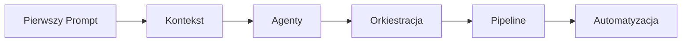
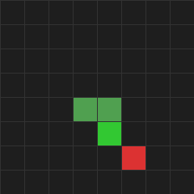
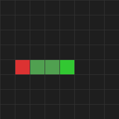
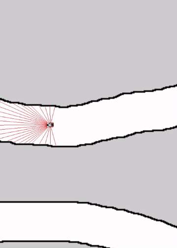
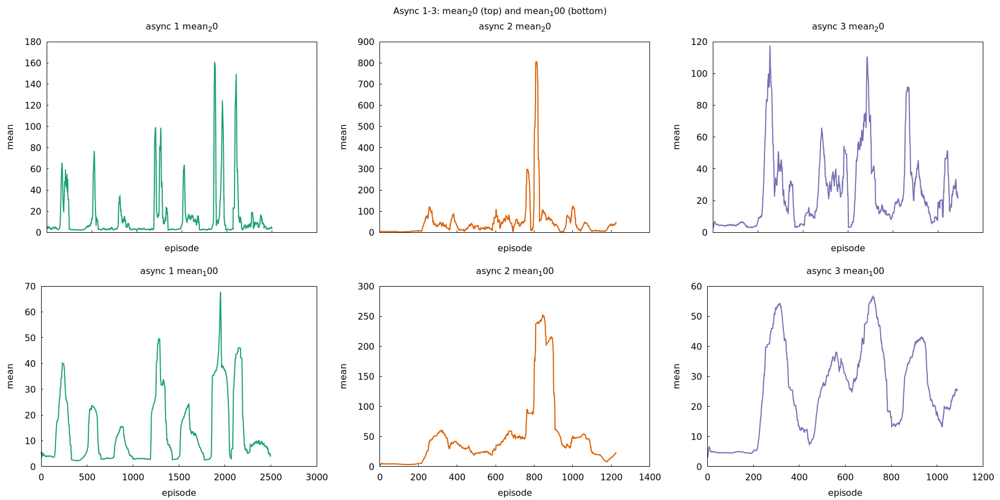

# Vibe Coding z AI — Kurs Programowania z Claude Code

Zbudowałem 6 projektów AI. Większość kodu napisał Claude.
Oto kompletny kurs jak to robić — od pierwszego prompta po orkiestrację 6-agentowego teamu.

> **Nie wiesz od czego zacząć? Nie masz pomysłu na stack, architekturę, ani jak ugryźć swój projekt?**
> To normalne. Nie musisz wiedzieć wszystkiego na starcie. Otwórz Claude Code i po prostu opisz co chcesz zbudować — Claude pomoże Ci wymyślić jak to zrobić. Zapytaj: *"Chcę zrobić X, ale nie wiem jakiego stacku użyć ani jak to zaprojektować. Pomóż mi to przemyśleć."* — i razem dojdziecie do planu. Vibe coding zaczyna się od rozmowy, nie od wiedzy.



---

## Spis Treści

- [Czym Jest Vibe Coding?](#czym-jest-vibe-coding)
- [Etap 0: Instalacja i Pierwszy Prompt](#etap-0-instalacja-i-pierwszy-prompt)
- [Etap 1: Kontekst Jest Królem](#etap-1-kontekst-jest-królem)
- [Etap 2: Agenty i Delegowanie](#etap-2-agenty-i-delegowanie)
- [Etap 3: Orkiestracja Multi-Agent (`/ceo`)](#etap-3-orkiestracja-multi-agent-ceo)
- [Etap 4: Pełny Pipeline](#etap-4-pełny-pipeline)
- [Etap 5: Automatyzacja i Narzędzia](#etap-5-automatyzacja-i-narzędzia)
- [Materiały i Linki](#materiały-i-linki)

---

## Czym Jest Vibe Coding?

Vibe coding to programowanie, w którym Ty nie piszesz kodu. Piszesz intencje. Opisujesz co chcesz, a AI generuje implementację. Ty przeglądasz, poprawiasz kurs, i idziesz dalej. To nie jest "GitHub Copilot, który podpowiada linijki". To jest tryb, w którym Claude pisze cały plik, cały moduł, cały projekt — a Ty decydujesz, co ma powstać i czy wynik jest dobry.

Pomyśl o tym jak o reżyserowaniu filmu. Reżyser nie obsługuje kamery. Nie ustawia świateł. Nie gra w scenach. Ale to reżyser decyduje o każdym ujęciu, o nastroju, o tempie. Bez reżysera masz zespół techników, którzy robią losowe rzeczy. Z reżyserem masz film. Ty jesteś reżyserem. Claude jest całą ekipą filmową.

Żeby to działało, musisz myśleć na wyższym poziomie niż "jak napisać pętlę for". Musisz myśleć: jaka architektura? Jakie komponenty? Jakie API między nimi? Jakie edge case'y mogą się pojawić? To jest trudniejsze niż się wydaje, ale jednocześnie — dużo szybsze. Projekt, który zajmowałby tydzień ręcznego kodowania, powstaje w jeden wieczór. Nie dlatego, że AI jest magiczne, ale dlatego, że eliminujesz najwolniejszy element: wpisywanie kodu znak po znaku.

Ten kurs przeprowadzi Cię przez pięć etapów — od pierwszego prompta po zarządzanie teamem agentów, które budują za Ciebie złożone projekty. Każdy etap ma ćwiczenia i checkpoint w postaci prawdziwego projektu, który zbudowałem tą metodą. Żadnej teorii w próżni — wszystko jest przetestowane w boju.

---

## Etap 0: Instalacja i Pierwszy Prompt

### Instalacja Claude Code

```bash
# Wymagania: Node.js 18+
npm install -g @anthropic-ai/claude-code

# Uruchomienie w katalogu projektu
cd twoj-projekt/
claude
```

Po uruchomieniu `claude` otwiera się interaktywna sesja w terminalu. Claude widzi Twój katalog, może czytać pliki, pisać pliki, uruchamiać komendy. To nie jest chatbot w przeglądarce — to agent z pełnym dostępem do Twojego systemu plików.

### Narzędzia, które Claude ma do dyspozycji

Kiedy Claude pracuje, używa tych narzędzi:

| Narzędzie | Co robi |
|-----------|---------|
| `Read` | Czyta pliki z dysku |
| `Write` | Tworzy nowe pliki |
| `Edit` | Edytuje istniejące pliki (precyzyjny find-and-replace) |
| `Bash` | Uruchamia komendy w terminalu |
| `Grep` | Szuka wzorców w kodzie |
| `Glob` | Szuka plików po nazwie/rozszerzeniu |
| `Agent` | Uruchamia sub-agenta do złożonych zadań |

Nie musisz mówić Claude'owi, którego narzędzia użyć. On sam decyduje. Ale warto wiedzieć, co ma w arsenale — to pomaga pisać lepsze prompty.

### Dobry prompt vs zły prompt

To jest najważniejsza umiejętność w vibe codingu. Różnica między dobrym a złym promptem to różnica między działającym projektem a frustracją.

```
❌ ZŁY: "Zrób mi grę"
```
Claude nie wie: jaką grę? W jakim języku? Jaka biblioteka? Jaka rozdzielczość? Ile plików? Co ma się dziać?

```
✅ DOBRY: "Stwórz grę Snake w Pythonie z pygame. Plansza 20x20,
wąż sterowany strzałkami, jabłko w losowym miejscu,
wynik wyświetlany na ekranie. Jeden plik: snake.py"
```
Claude wie dokładnie co zrobić. Zero domysłów.

Kolejne przykłady:

```
❌ ZŁY: "Napisz mi sieć neuronową"

✅ DOBRY: "Stwórz plik src/model.py z siecią DQN w PyTorch:
- Input: 9 features (pozycja głowy, kierunek, odległości od przeszkód)
- Hidden: 2 warstwy po 256 neuronów, ReLU
- Output: 4 akcje (góra, dół, lewo, prawo)
- Metoda forward() i select_action() z epsilon-greedy"
```

```
❌ ZŁY: "Popraw ten błąd"

✅ DOBRY: "W pliku src/train.py linia 47: agent.train_step() zwraca None
zamiast loss. Sprawdź dlaczego — prawdopodobnie brakuje return statement
w metodzie train_step() w src/agent.py"
```

```
❌ ZŁY: "Zoptymalizuj trening"

✅ DOBRY: "Trening utknął na reward ~50 po 10k epizodów.
Sprawdź training CSV w runs/latest/progress.csv.
Zdiagnozuj czy to: (a) za niski learning rate, (b) za mały replay buffer,
(c) problem z reward shaping. Zaproponuj konkretne zmiany z uzasadnieniem."
```

💡 **Zasada kciuka:** Jeśli prompt nie mówi Claude'owi, jaki plik ma stworzyć/edytować i jaki ma być efekt końcowy — jest za ogólny.

### Co sprawdzać w output AI

Claude napisał kod. Co teraz? Nie akceptuj ślepo. Sprawdź:

1. **Czy się uruchamia?** — Najprostsza weryfikacja. `python main.py` i patrzysz.
2. **Czy robi to, co chciałeś?** — Nie to, co Claude myśli że chciałeś. Twoja intencja.
3. **Edge case'y** — Co się stanie jak plansza będzie pusta? Jak wąż uderzy w ścianę dwa razy z rzędu? Jak plik nie istnieje?
4. **Bezpieczeństwo** — Czy Claude nie dodał `subprocess.call(shell=True)` albo nie czyta plików, których nie powinien?
5. **Prostota** — Czy rozwiązanie nie jest przekombinowane? 50 linii kodu zamiast 200?

⚠️ **Uwaga:** Claude czasem "halucynuje" API — użyje funkcji, która nie istnieje w danej bibliotece, albo poda złe argumenty. Zawsze uruchom kod i sprawdź.

### Ćwiczenie 1: Zbuduj prostą grę jednym promptem

Napisz jeden prompt do Claude Code i zbuduj prostą grę (Snake, Pong, Breakout — co chcesz). Zasady:

1. Prompt musi zawierać: język, bibliotekę, rozmiar planszy, sterowanie, warunki wygranej/przegranej
2. Wynik: jeden działający plik
3. Uruchom grę i zagraj minimum 30 sekund
4. Zapisz prompt, który użyłeś — przyda się do porównania później

Szczegóły: [exercises/01-pierwsza-gra.md](exercises/01-pierwsza-gra.md)

---

## Etap 1: Kontekst Jest Królem

Claude Code zaczyna każdą rozmowę z czystą kartą. Nie pamięta wczorajszej sesji. Nie wie, co zrobiłeś tydzień temu. Jedyne, co wie, to to co mu dasz.

Dlatego kontekst to fundament. Bez kontekstu Claude jest genialnym programistą z amnezją. Z kontekstem — jest członkiem Twojego teamu, który zna projekt od podszewki.

### CLAUDE.md — najważniejszy plik w projekcie

`CLAUDE.md` w katalogu głównym projektu jest automatycznie czytany przez Claude Code na starcie każdej sesji. To Twoje instrukcje operacyjne. Think of it as a briefing for a new team member.

Co powinien zawierać:

```markdown
# Nazwa Projektu

Krótki opis — jedno zdanie, co ten projekt robi.

## Stack
- Python 3.11, PyTorch 2.1, pygame
- Trening: GPU (CUDA), Inference: CPU

## Architektura
- `src/env.py` — środowisko gry (game logic + gym-like API)
- `src/agent.py` — agent RL (DQN z replay bufferem)
- `src/train.py` — pętla treningowa
- `src/play.py` — wizualizacja wytrenowanego agenta
- `config/hyperparams.yaml` — wszystkie hiperparametry

## Konwencje
- Każda klasa w osobnym pliku
- Type hints wszędzie
- Docstring na każdej publicznej metodzie
- Testy w `tests/` z pytest

## Jak uruchomić
- Trening: `python -m src.train --config config/hyperparams.yaml`
- Demo: `python -m src.play --model checkpoints/best.pth`

## Czego NIE robić
- NIE modyfikuj env.step() bez aktualizacji testów
- NIE zmieniaj observation space bez aktualizacji agenta
- NIE używaj print() do logowania — użyj logger z src/utils.py
```

Pełny przewodnik po CLAUDE.md: [examples/02-claude-md-przewodnik.md](examples/02-claude-md-przewodnik.md)

Template do skopiowania: [templates/CLAUDE.md](templates/CLAUDE.md)

#### Przed i po: ten sam prompt, z CLAUDE.md i bez

**Bez CLAUDE.md:**
```
Prompt: "Dodaj epsilon decay do agenta"
```
Claude nie wie, gdzie jest agent. Nie wie, czy epsilon jest w konfigu czy hardcoded. Nie wie, jaką konwencję stosujemy. Tworzy rozwiązanie, które może nie pasować do reszty projektu.

**Z CLAUDE.md:**
```
Prompt: "Dodaj epsilon decay do agenta"
```
Claude wie, że agent jest w `src/agent.py`. Wie, że hiperparametry są w `config/hyperparams.yaml`. Wie, że używamy type hints i docstrings. Tworzy rozwiązanie, które idealnie wpasowuje się w istniejący kod.

Różnica jest dramatyczna. CLAUDE.md to najlepsza inwestycja czasu w cały projekt — 15 minut pisania oszczędza godziny poprawek.

### Folder `.context/` — trwała wiedza o projekcie

CLAUDE.md to instrukcje operacyjne. Ale co z wiedzą o stanie projektu? Co działa? Co jest w trakcie? Jakie decyzje podjęliśmy i dlaczego?

Do tego służy folder `.context/` z trzema plikami:

**INDEX.md** — punkt wejścia:
```markdown
# Snake DQN - Kontekst Projektu

- KNOWLEDGE.md — architektura, stack, jak uruchomić
- STATE.md — co działa, co w trakcie, co dalej

Ostatnia aktualizacja: 2025-12-15
```

**KNOWLEDGE.md** — wiedza statyczna (zmienia się rzadko):
```markdown
## Architektura
Multi-environment DQN z wektoryzowanym środowiskiem.
16 środowisk działa równolegle, agent zbiera doświadczenia ze wszystkich.

## Kluczowe Pliki
- src/vec_env.py — wektoryzowane środowisko (numpy, zero kopii)
- src/agent.py — DQN z Dueling architecture + PER
- src/train.py — pętla treningowa z TensorBoard logowaniem

## Jak uruchomić
source .venv/bin/activate
python -m src.train
```

**STATE.md** — stan dynamiczny (zmienia się często):
```markdown
## Co działa
- Środowisko gry: w pełni funkcjonalne, 16 env parallel
- Agent: Dueling DQN z PER, trenuje stabilnie
- Wizualizacja: pygame renderer + training curve plots

## W trakcie
- Testowanie reward shaping (wariant z odległością od jabłka)

## Ostatnie zmiany
- 2025-12-14: Zmieniono PER na proporcjonalny (z rankowego) — 15% szybsza zbieżność
- 2025-12-13: Dodano n-step returns (n=3) — stabilniejszy trening

## Znane problemy
- Przy planszy 30x30 agent potrzebuje 2x więcej epizodów
- Memory leak w wizualizacji po ~1h continuous play
```

Template: [templates/.context/](templates/.context/)

💡 **Tip:** Możesz wygenerować `.context/` automatycznie. Wystarczy powiedzieć Claude'owi: "Przeskanuj ten projekt i stwórz folder .context/ z INDEX.md, KNOWLEDGE.md i STATE.md."

### `/start` i `/dump` — komendy zarządzania kontekstem

Dwie komendy, które powinny być Twoim odruchem na początku i końcu każdej sesji:

**`/start`** — ładuje cały kontekst projektu na starcie sesji. Claude czyta `.context/INDEX.md`, `KNOWLEDGE.md`, `STATE.md` i od razu wie: jaki jest stack, co działa, co jest w trakcie, jakie są znane problemy. Bez tego każda sesja zaczyna się od zera — Claude nie wie nic o Twoim projekcie i musisz mu wszystko tłumaczyć od nowa.

```
Ty: /start
Claude: [czyta .context/, ładuje wiedzę]
  → "Projekt: Snake DQN Multi-Env. Stack: Python, PyTorch, pygame.
     Co działa: środowisko gry, agent Dueling DQN.
     WIP: testowanie reward shaping.
     Gotowy do pracy."
```

**`/dump`** — zapisuje wiedzę zdobytą w trakcie sesji do `.context/`. Użyj na końcu sesji, po istotnych zmianach, albo kiedy Claude odkrył coś ważnego o projekcie. To jak zapisanie stanu gry — następna sesja startuje z pełnym kontekstem.

```
Ty: /dump
Claude: [skanuje projekt, aktualizuje KNOWLEDGE.md i STATE.md]
  → "Zaktualizowałem STATE.md: dodano nowy reward shaping z odległością
     od jabłka, znany problem z memory leak w wizualizacji."
```

⚠️ **Ważne:** Bez `/start` na początku sesji, Claude nie wie nic. Bez `/dump` na końcu, Claude zapomni wszystko co odkrył. Te dwie komendy to Twoja pamięć między sesjami.

**Workflow:**
```
1. Otwierasz sesję   → /start (Claude ładuje kontekst)
2. Pracujesz         → budujesz, debugujesz, testujesz
3. Kończysz sesję    → /dump (Claude zapisuje co się zmieniło)
4. Następna sesja    → /start (Claude jest od razu w temacie)
```

### `lessons.md` — uczenie Claude'a na błędach

To jest Twoja tajna broń. Plik, w którym zapisujesz lekcje wyciągnięte z błędów — Twoich i Claude'a. Każda lekcja ma format:

```markdown
## Lekcja: Nigdy nie przekazuj valid_mask do forward() Dueling DQN

**Problem:** Agent dostawał valid_mask jako argument forward(),
co powodowało masking na poziomie Q-values zamiast na poziomie action selection.
Efekt: agent "uczył się" że nielegalne akcje mają Q=0, co zaburzało gradienty.

**Rozwiązanie:** valid_mask stosuj TYLKO w select_action(), nigdy w forward().
forward() zwraca surowe Q-values dla WSZYSTKICH akcji.

**Jak zastosować:** Kiedy implementujesz action masking w DQN/Dueling DQN,
sprawdź czy mask jest w select_action() a nie w forward().
```

```markdown
## Lekcja: Sprawdź wymiary tensorów ZANIM zaczniesz trening

**Problem:** Tensor observation miał shape (9,) zamiast (batch_size, 9).
Trening "działał" ale loss był nonsensowny. 3 godziny debugowania.

**Rozwiązanie:** Na początku train_step() dodaj assert:
assert states.shape == (batch_size, obs_dim), f"Expected {(batch_size, obs_dim)}, got {states.shape}"

**Jak zastosować:** Przy KAŻDYM nowym agencie dodaj asserty na shape
tensorów w train_step() ZANIM zaczniesz trening.
```

Dlaczego to działa? Bo Claude czyta `lessons.md` na starcie sesji (jeśli masz to w CLAUDE.md lub w `.claude/` config). Więc następnym razem, kiedy będzie implementował DQN, NIE popełni tego samego błędu. To jak onboarding document dla nowego członka teamu — tyle że ten nowy członek ma amnezję i musi go czytać za każdym razem.

Template: [templates/lessons.md](templates/lessons.md)

### 🏆 CHECKPOINT: Flappy Bird AI

Czas na pierwszy prawdziwy projekt. Zbudujemy Flappy Bird z AI, który się uczy grać.

**Krok 1: Stwórz CLAUDE.md**
```markdown
# Flappy Bird AI

Gra Flappy Bird + agent DQN, który uczy się grać.

## Stack
- Python, pygame, PyTorch
- Jeden katalog: src/

## Pliki
- src/game.py — logika gry (ptak, rury, kolizje, scoring)
- src/agent.py — DQN agent (replay buffer, epsilon-greedy, target network)
- src/train.py — pętla treningowa
- src/play.py — demo z wytrenowanym modelem
- config.py — wszystkie hiperparametry w jednym miejscu
```

**Krok 2: Zbuduj grę**
```
Prompt: "Stwórz src/game.py — kompletną logikę Flappy Bird:
- Klasa FlappyBirdEnv z gym-like API (reset, step, get_state)
- Grawitacja, flap, rury z losową wysokością
- Observation: [bird_y, bird_velocity, dist_to_pipe, pipe_top, pipe_bottom, score]
- Reward: +1 za przejście rury, -1 za śmierć, +0.1 za przetrwanie frame'a
- render() z pygame"
```

**Krok 3: Zbuduj agenta**
```
Prompt: "Stwórz src/agent.py — DQN agent:
- ReplayBuffer z deque, capacity 100_000
- DQN sieć: 6 inputs → 128 → 128 → 2 outputs (flap / no-flap)
- Target network update co 1000 kroków
- Epsilon: 1.0 → 0.01, decay 0.9995
- Batch size 64, gamma 0.99, lr 0.0005"
```

**Krok 4: Training loop + iteracja**
```
Prompt: "Stwórz src/train.py — trening z logowaniem:
- Loguj: episode, reward, epsilon, loss do CSV
- Zapisuj model co 100 epizodów
- Wyświetlaj progress bar z tqdm"
```

Uruchom trening, obserwuj krzywe. Agent powinien zacząć stabilnie przechodzić rury po 500-1000 epizodów. Jeśli nie — analizuj CSV z Claude'em:

```
Prompt: "Przeczytaj runs/latest/progress.csv. Agent nie uczy się po 1000 epizodów
(reward ~0). Zdiagnozuj problem i zaproponuj fix."
```

**Wynik:**


Repozytorium: [github.com/Beba-ai-ml/flappy-bird-ai](https://github.com/Beba-ai-ml/flappy-bird-ai)

### Ćwiczenie 2: Stwórz CLAUDE.md dla dowolnego projektu

Wybierz projekt (istniejący lub nowy) i napisz dla niego CLAUDE.md. Musi zawierać:

1. Opis projektu (1 zdanie)
2. Stack technologiczny
3. Lista kluczowych plików z opisem
4. Konwencje kodowania
5. Jak uruchomić
6. Czego NIE robić (min. 3 reguły)

Szczegóły: [exercises/02-claude-md.md](exercises/02-claude-md.md)

---

## Etap 2: Agenty i Delegowanie

Do tej pory rozmawiałeś z Claude'em 1-na-1. Ty piszesz prompt, Claude robi. Piszesz kolejny, Claude robi kolejny. To działa, ale jest wolne. I zaśmieca kontekst — po 50 wiadomościach Claude zaczyna "zapominać" początek rozmowy, bo context window się wypełnia.

Agenty rozwiązują oba problemy. Agent to oddzielna sesja Claude'a, która dostaje jedno konkretne zadanie, wykonuje je, i zwraca wynik. Twoja główna konwersacja zostaje czysta.

### Czym jest agent?

Agent to subprocess — nowa instancja Claude'a z własnym context window. Dostaje prompt, ma dostęp do tych samych narzędzi (Read, Write, Edit, Bash...), pracuje w tle, i zwraca wynik kiedy skończy.

W Claude Code masz kilka sposobów uruchomienia agenta:

1. **Tool: Task** — uruchamiasz sub-agenta z poziomu głównej konwersacji
2. **Tool: Agent** — lekki agent do eksploracji/szukania
3. **Worktree** — agent dostaje osobną kopię repo (izolacja)

### Kiedy używać agentów?

Używaj agenta kiedy:

- **Zadanie jest samodzielne** — agent nie potrzebuje Twojego feedbacku w trakcie
- **Chcesz pracować równolegle** — 3 agenty jednocześnie = 3x szybciej
- **Chcesz czysty kontekst** — main conversation nie rośnie
- **Zadanie jest dobrze zdefiniowane** — wiesz dokładnie co chcesz na wyjściu

Nie używaj agenta kiedy:

- Zadanie wymaga iteracji z Tobą (review → fix → review → fix)
- Nie wiesz jeszcze co chcesz (eksploracja, brainstorming)
- Zmiana jest triwialna (zmień nazwę zmiennej)

### Jak pisać prompty dla agentów

Agent nie ma kontekstu Twojej rozmowy. Dostaje TYLKO to, co mu dasz. Dlatego prompt agenta musi być samodzielny — kompletny briefing.

Szablon:

```
"Jesteś [rola]. [Kontekst projektu — 2-3 zdania].

Twoje zadanie:
[Dokładny opis — co stworzyć/zmodyfikować]

Wymagania:
- [wymóg 1]
- [wymóg 2]
- [wymóg 3]

Ograniczenia:
- NIE modyfikuj [pliki]
- NIE zmieniaj [interfejsy]

Definicja ukończenia:
- [plik X istnieje i ma Y]
- [komenda Z działa bez błędów]"
```

Konkretny przykład:

```
"You are a senior Python developer. The project is a Snake game with DQN AI
in src/. The environment is already done (src/env.py, gym-like API).

Create src/agent.py implementing a Double DQN agent with:
- ReplayBuffer class (circular buffer using numpy arrays, O(1) push, O(n) sample)
- DQNAgent class with:
  - select_action(state, epsilon) → action (int)
  - train_step(batch) → loss (float)
  - update_target_network()
  - save(path) / load(path)
- Use PyTorch, batch_size=64, gamma=0.99, lr=1e-4
- Network: Linear(obs_dim, 256) → ReLU → Linear(256, 256) → ReLU → Linear(256, n_actions)

Do NOT modify any other files.
Test by running: python -c 'from src.agent import DQNAgent; a = DQNAgent(12, 4); print(a)'"
```

💡 **Tip:** Pisz prompty agentów po angielsku. Claude myśli lepiej po angielsku, a Ty oszczędzasz tokeny (angielski jest ~30% tańszy niż polski w tokenach).

### Równoległe agenty

Tu się zaczyna magia. Możesz uruchomić wiele agentów jednocześnie, każdy pracujący nad innym plikiem.

Przykład — budujesz grę z AI. Jeden prompt do Claude'a:

```
Uruchom 3 agentów równolegle:

Agent 1 — Game Engine:
"Create src/env.py — Snake environment with gym API.
Board 20x20, 4 actions, observation: 12 features..."

Agent 2 — AI Agent:
"Create src/agent.py — DQN agent with replay buffer.
Input: 12 features, output: 4 actions..."

Agent 3 — Training Loop:
"Create src/train.py — training loop.
Uses env from src/env.py and agent from src/agent.py.
Assume standard gym API: env.reset(), env.step(action)..."
```

Trzy pliki powstają jednocześnie. Zero konfliktów, bo każdy agent pisze inny plik. Czas: tyle co jeden agent, a masz 3x więcej kodu.

⚠️ **Uwaga:** Agenty muszą pracować na rozdzielnych plikach. Jeśli dwa agenty edytują ten sam plik — będą konflikty i chaos. Planuj podział pracy ZANIM odpalisz agentów.

### `/krytyk` — recenzja kodu przez dwóch niezależnych AI krytyków

Jedną z najcenniejszych umiejętności jest recenzja kodu ZANIM go zmergeujesz. `/krytyk` to skill (custom command), który uruchamia **dwóch niezależnych krytyków na modelu opus** — każdy recenzuje Twoje zmiany z innej perspektywy. Potem dyskutują ze sobą aż do konsensusu.

**Jak to wygląda w praktyce:**

```
Ty: Chcę dodać NoisyNet exploration do mojego DQN agenta.
     [opisujesz zmiany albo masz je staged w git]

Ty: /krytyk

Claude: Uruchamiam 2 krytyków...

Krytyk 1 (Teoria/Algorytmy):
┌──────────────────────────────────────────────────────────┐
│ KRYTYCZNY: Survival reward 0.1 z gamma=0.99 daje         │
│ Q-contribution = 0.1/(1-0.99) = 10.0                     │
│ Reward za przejście pipe: 1.0 * gamma^67 = 0.51          │
│ Stosunek 20:1 — agent racjonalnie IGNORUJE pipe'y.       │
│ FIX: Zmniejsz survival reward do 0.01                    │
│                                                           │
│ WAŻNY: NoisyNet na inicjalizacji produkuje BIASED        │
│ exploration (wszystkie sigma startują z tą samą wartością)│
│ FIX: Random warmup przez pierwsze N kroków, potem NoisyNet│
│                                                           │
│ WAŻNY: CNN grad_clip=1.0 za niski — gradienty CNN        │
│ routynowo mają normy 5-15. Efektywnie obcinasz LR 5-15x. │
│ FIX: grad_clip=10.0 dla CNN                              │
└──────────────────────────────────────────────────────────┘

Krytyk 2 (Inżynieria/Implementacja):
┌──────────────────────────────────────────────────────────┐
│ BUG: select_action() zawsze wywołuje model.train() na    │
│ końcu — psuje zewnętrzne bloki eval(). Deterministic     │
│ evaluation biegnie Z szumem NoisyNet cały czas.          │
│ FIX: if not deterministic: model.train()                 │
│                                                           │
│ BUG: action_repeat=4 + train_every_n_steps=4 =           │
│ efektywny update ratio 1/16 game frames, nie 1/4.        │
│ FIX: train_every_n_steps=1 gdy action_repeat > 1         │
│                                                           │
│ BUG: watch.py nie przekazuje deterministic=True.          │
│ Wytrenowany agent wygląda losowo przy pokazie.            │
│ FIX: select_action(state, deterministic=True)             │
└──────────────────────────────────────────────────────────┘

Konsensus: 6 issues, 3 krytyczne. Lista fixów...
```

To jest **prawdziwy wynik** z recenzji projektu Flappy Bird AI. Bez `/krytyk` te bugi trafiłyby do treningu — godziny zmarnowane na debugging "dlaczego agent się nie uczy", a odpowiedź to zły grad_clip i zły survival reward.

**Kiedy używać `/krytyk`:**
- ✅ Nowa architektura agenta RL
- ✅ Zmiana w wielu plikach naraz
- ✅ Cokolwiek związanego z reward shaping / hyperparams
- ✅ PWA, service workery, cache'owanie
- ❌ Zmiana koloru buttona
- ❌ Poprawka literówki w README

**Prawdziwe statystyki:**
- RSVP PWA review: **20 issues** znalezionych (brakujący pdf.worker.js, błędne font URL, cache versioning)
- Flappy Bird AI: **6 bugów** (reward imbalance, grad_clip, NoisyNet warmup, eval mode, action_repeat, watch.py)
- Zadania (math splitter): **2 krytyczne** (scrollable container + absolute overlay conflict, long-press/drag race condition)

⚠️ **Zasada:** Im więcej plików zmienia Twoja zmiana, tym bardziej potrzebujesz `/krytyk`. Jeden plik? Opcjonalnie. Trzy pliki? Zdecydowanie. Nowa architektura? **Obowiązkowo.**

**Z perspektywy jednego projektu:** RSVP PWA reader miał 20 issues. Bez krytyków każdy z nich to potencjalny dzień debugowania. 20 dni → 1 godzina recenzji. To jest ROI `/krytyk`.

Pełna sesja z komentarzem: [examples/03-sesja-krytyk.md](examples/03-sesja-krytyk.md)

Przykład z prawdziwego projektu — jak wyglądał raport krytyków dla RSVP PWA reader:

```
Critic 1 znalazł:
- Race condition w service worker (cache update vs fetch)
- Brak fallbacku gdy localStorage jest full
- XSS vulnerability w innerHTML z user input
- ...12 kolejnych issues

Critic 2 znalazł:
- Memory leak w animation loop (requestAnimationFrame bez cleanup)
- Brak debounce na window.resize handler
- Accessibility: brak aria-labels na controls
- ...8 kolejnych issues
```

Razem 20+ issues, które bym przegapił. Koszt: ~30 sekund i kilka centów za tokeny.

Przykład z Flappy Bird AI:

```
Critic 1:
- Reward imbalance: +1 za rurę vs -1 za śmierć, ale śmierć jest 100x częstsza
  na początku → agent uczy się "nie flapuj nigdy" bo minimalizuje -1
- Sugestia: +5 za rurę, -1 za śmierć, 0 za frame

Critic 2:
- grad_clip za niski (0.5) → gradienty ucinane → slow learning
- Sugestia: grad_clip=10 lub adaptive clipping
```

Oba trafione. Bez krytyka mógłbym spędzić godziny debugując "dlaczego agent się nie uczy", nie widząc oczywistego problemu z rewardem.

Szczegóły i log z sesji: [examples/03-sesja-krytyk.md](examples/03-sesja-krytyk.md)

💡 **Tip:** Używaj `/krytyk` przed KAŻDĄ nietrivialną zmianą. Zmiana w jednym pliku? Nie trzeba. Nowa architektura agenta RL? Absolutnie tak.

### 🏆 CHECKPOINT: Snake DQN Multi-Env

Budujemy Snake z DQN, ale tym razem na poważnie — wektoryzowane środowisko (16 gier naraz), Dueling DQN z Prioritized Experience Replay.

Strategia budowania:

```
Agent 1: "Stwórz src/vec_env.py — wektoryzowane środowisko Snake.
16 gier działających równolegle w numpy (zero Pythonowych pętli po env).
API: reset() → obs[16, 12], step(actions[16]) → obs, rewards, dones, infos"

Agent 2: "Stwórz src/agent.py — Dueling DQN z PER.
Dueling architecture: shared → value stream + advantage stream.
PER: SumTree implementation, alpha=0.6, beta=0.4→1.0"

Agent 3: "Stwórz src/train.py — training loop.
Zbiera doświadczenia z vec_env, trenuje agenta, loguje do CSV + TensorBoard."
```

Po zbudowaniu — `/krytyk` na każdym pliku. Poprawki. Trening. Analiza krzywych. Iteracja.



Repozytorium: [github.com/Beba-ai-ml/snake-dqn-multi-env](https://github.com/Beba-ai-ml/snake-dqn-multi-env)

### 🏆 CHECKPOINT: Snake Behavioral Cloning

Ten sam Snake, ale zupełnie inna metoda. Zamiast RL — Behavioral Cloning. Agent obserwuje ludzką grę i uczy się naśladować.

Pipeline:

1. **Agent-kolektor:** zbiera dane z ludzkiej gry (observation, action) do CSV
2. **Agent-trener:** trenuje sieć supervised na zebranych danych
3. **Agent-ewaluator:** testuje wytrenowany model i raportuje wyniki

Każdy etap to osobny agent. Każdy pisze inne pliki. Wszystko kontrolowane z poziomu jednej konwersacji.



Repozytorium: [github.com/Beba-ai-ml/snake-behavioral-cloning](https://github.com/Beba-ai-ml/snake-behavioral-cloning)

### Ćwiczenie 3: Zbuduj projekt z 2+ równoległymi agentami

Wybierz projekt (gra, narzędzie, cokolwiek) i zbuduj go używając minimum 2 agentów działających równolegle. Zasady:

1. Napisz CLAUDE.md zanim zaczniesz
2. Zaplanuj podział plików — każdy agent ma swoje
3. Uruchom agentów równolegle
4. Użyj `/krytyk` na wyniku
5. Popraw issues znalezione przez krytyków

Szczegóły: [exercises/03-parallel-agents.md](exercises/03-parallel-agents.md)

---

## Etap 3: Orkiestracja Multi-Agent (`/ceo`)

Dwa agenty to dobry start. Ale co jeśli projekt wymaga sześciu? Albo dziesięciu? Co jeśli niektóre zadania zależą od innych? Co jeśli potrzebujesz różnych modeli AI do różnych zadań (opus do architektury, sonnet do implementacji, haiku do boilerplate)?

To jest moment, w którym przestajesz być programistą-z-asystentem i stajesz się CTO z teamem.

### CEO Agent — Twój execution engine

`/ceo` to skill, który zamienia jedno high-level polecenie w kompletny plan wykonania z podziałem na role, fazy i agentów. Ty mówisz CO chcesz. CEO decyduje JAK to zbudować.

**Jak to wygląda w praktyce:**

```
Ty: /ceo Zbuduj grę Tetris z AI agentem, który uczy się grać.
    Tetris musi mieć pełną logikę (7 tetromino, rotation, line clear).
    AI widzi board state i wybiera placement (kolumna + rotacja).

CEO: [analizuje zadanie, projektuje team]

┌─────────────────────────────────────────────────────────────┐
│  CEO EXECUTION PLAN: Tetris AI                              │
│                                                             │
│  Team:                                                      │
│  | # | Rola            | Model  | Pliki              | Faza │
│  | 1 | Architekt       | opus   | ARCHITECTURE.md    | 1    │
│  | 2 | Game Engine     | sonnet | board.py, pieces.py| 2    │
│  | 3 | AI/RL Dev       | opus   | agent.py, model.py | 2    │
│  | 4 | Renderer        | sonnet | renderer.py        | 2    │
│  | 5 | Training Loop   | sonnet | train.py, cli.py   | 2    │
│  | 6 | Tester + Krytyk | opus   | tests/, review     | 3    │
│                                                             │
│  Faza 1: Architekt (sam)                                    │
│  Faza 2: Game + AI + Renderer + Training (równolegle)       │
│  Faza 3: Tester + Krytyk (po fazie 2)                       │
│                                                             │
│  Estimated agents: 6                                        │
│  Spawning...                                                │
└─────────────────────────────────────────────────────────────┘
```

Ty nie musisz wiedzieć jakie pliki stworzyć, ile agentów uruchomić, ani w jakiej kolejności. CEO to wie. Ty jesteś CTO — zatwierdzasz plan, a CEO go wykonuje.

**Jak to działa krok po kroku:**

1. **Analiza zadania** — CEO czyta Twoje polecenie i CLAUDE.md projektu
2. **Projektowanie teamu** — tworzy org chart: kto, co, jakim modelem, w jakiej kolejności
3. **Faza 1: Architektura** — agent-architekt projektuje API, interfejsy, strukturę plików
4. **Faza 2: Implementacja** — wielu agentów równolegle piszących kod (każdy ma przypisane pliki)
5. **Faza 3: Integracja i Review** — agent łączy wszystko, krytyk recenzuje wynik
6. **Raport** — CEO podsumowuje co zrobiono, co wymaga uwagi

**Co Ty robisz w tym czasie?** Nic. Albo pijesz kawę. Albo pracujesz nad czymś innym. CEO odpala agentów w tle i informuje Cię jak skończą. Ty interweniujesz tylko gdy trzeba podjąć decyzję (np. "afterstate vs standard DQN?").

⚠️ **Ważne:** `/ceo` nie daje perfekcyjnego wyniku za pierwszym razem. Daje solidną bazę, która wymaga 1-2 rund poprawek. Ale ta baza powstaje w godzinę zamiast tygodnia.

### Projektowanie teamu

CEO dobiera model AI do zadania:

| Typ zadania | Model | Dlaczego |
|-------------|-------|----------|
| Architektura, design API | opus | Najlepszy w planowaniu, widzi big picture |
| Core logic, algorytmy | opus | Złożone rozumowanie, mniej bugów |
| Feature'y, UI, renderer | sonnet | Szybszy, wystarczająco dobry do standardowego kodu |
| Boilerplate, config, testy | haiku | Najtańszy, idealny do prostych zadań |
| Code review, QA | opus | Łapie subtelne bugi |

Kluczowe zasady podziału:

- **Każdy agent ma przypisane pliki** — zero overlappów
- **Dependency graph** — kto blokuje kogo? Architektura musi być pierwsza.
- **Kontrakty API** — agenty implementacyjne dostają interfejsy z fazy architekturalnej

### Prawdziwa sesja `/ceo`: Tetris AI

Polecenie:
```
/ceo Zbuduj grę Tetris z AI agentem (afterstate DQN), który uczy się grać.
Tetris musi mieć pełną logikę (7 tetromino, rotation, line clear, scoring).
AI widzi board state i wybiera placement (kolumna + rotacja).
```

CEO zaprojektował team:

```
| # | Rola              | Model  | Pliki                          | Faza |
|---|-------------------|--------|--------------------------------|------|
| 1 | Architekt         | opus   | docs/ARCHITECTURE.md, API spec | 1    |
| 2 | Game Engine Dev   | sonnet | src/board.py, src/pieces.py    | 2    |
| 3 | AI/RL Dev         | opus   | src/agent.py, src/model.py     | 2    |
| 4 | Renderer Dev      | sonnet | src/renderer.py                | 2    |
| 5 | Training Pipeline | sonnet | src/train.py, src/evaluate.py  | 2    |
| 6 | Tester + Krytyk   | opus   | tests/, code review            | 3    |
```

**Faza 1:** Architekt stworzył specyfikację — observation space (board grid + current piece + stats), action space (rotation x column = 40 akcji), reward function (lines_cleared^2 + height_penalty).

**Faza 2:** Czterech agentów pracuje równolegle:
- Game Engine Dev pisze logikę Tetrisa (rotacja, kolizje, line clear)
- AI/RL Dev pisze afterstate DQN (ocenia board state PO umieszczeniu klocka)
- Renderer Dev pisze pygame wizualizację
- Training Pipeline łączy env z agentem w pętli treningowej

**Faza 3:** Tester uruchamia testy, krytyk recenzuje kod. Znaleziono:
- Bug w rotacji klocka T (off-by-one w collision detection)
- Brak clipping gradientów w agencie (Q-values eksplodowały)
- Memory leak w rendererze (brak `pygame.event.get()` w headless mode)

Wszystkie poprawione. Trening odpalony. Wynik po 50k epizodów:

**1,766 linii wyczyszczonych w jednej grze.**

Pełny log sesji: [examples/04-ceo-tetris.md](examples/04-ceo-tetris.md)


Repozytorium: [github.com/Beba-ai-ml/tetris-ai](https://github.com/Beba-ai-ml/tetris-ai)

### Co poszło dobrze, co wymagało poprawek

**Dobrze:**
- Podział na fazy uniknął konfliktów między agentami
- Kontrakty API z fazy 1 sprawiły, że kod z fazy 2 pasował do siebie
- Krytyk w fazie 3 złapał 3 bugi, które by kosztowały godziny debugowania

**Wymagało poprawek:**
- Afterstate evaluation wymagał iteracji — pierwszy prompt agenta RL nie uwzględnił "pustych" afterstate'ów (game over)
- Renderer potrzebował ręcznej poprawki kolorów klocków (estetyka, nie logika)
- Training hyperparams wymagały 3 rund tuningu z analizą krzywych

To normalny flow. `/ceo` nie daje perfekcyjnego wyniku za pierwszym razem. Daje solidną bazę, która wymaga iteracji. Ale ta baza powstaje w godzinę zamiast tygodnia.

### 🏆 CHECKPOINT: Tetris AI

Podsumowanie projektu Tetris:

- **Metoda:** Afterstate DQN — agent ocenia stan planszy PO umieszczeniu klocka
- **Budowanie:** `/ceo` → 6 agentów → 3 fazy → gotowy projekt
- **Wynik:** 1,766 linii w jednej grze
- **Czas budowania:** ~2h (wliczając iterację i tuning)
- **Ręcznie napisany kod:** 0 linii

Repozytorium: [github.com/Beba-ai-ml/tetris-ai](https://github.com/Beba-ai-ml/tetris-ai)

### Ćwiczenie 4: Użyj `/ceo` do zbudowania projektu

Wybierz projekt (sugestie: Breakout AI, 2048 AI, Pac-Man AI, lub cokolwiek innego) i zbuduj go z `/ceo`. Zasady:

1. Napisz CLAUDE.md
2. Daj `/ceo` jedno polecenie opisujące cel
3. Obserwuj jak CEO planuje i deleguje
4. Nie ingeruj w fazę implementacji — pozwól agentom pracować
5. Po zakończeniu: przejrzyj wynik, uruchom, ziteruj

Szczegóły: [exercises/04-ceo-build.md](exercises/04-ceo-build.md)

---

## Etap 4: Pełny Pipeline

### Agent Teams — kiedy agenty muszą ze sobą gadać

Subagenty (Task tool) są fire-and-forget: uruchamiasz, czekasz na wynik. Ale co kiedy agenty muszą komunikować się ze sobą? Kiedy Coder poprawia bug, a Tester musi go re-testować, a potem Coder poprawia następny issue?

Do tego służą Agent Teams (TeamCreate). Tworzymy team z agentami, którzy mogą pisać do siebie bezpośrednio, bez przechodzenia przez Ciebie.

**Kiedy Team zamiast subagentów:**

| Cecha | Subagenty | Team |
|-------|-----------|------|
| Komunikacja | Przez master agenta | Bezpośrednia między agentami |
| Feedback loop | Brak (one-shot) | Tak (build → test → fix → retest) |
| Czas życia | Jedno zadanie | Cała sesja |
| Najlepsze dla | Niezależnych zadań | Pipeline'ów i iteracji |

Przykład Team pipeline:

```
Team "Coder + Tester":

1. Coder implementuje feature
2. Tester uruchamia testy Playwright
3. Tester raportuje: "3 testy failed — button X nie działa na mobile"
4. Coder poprawia
5. Tester re-testuje: "All pass"
6. Raport do Ciebie: "Feature gotowy, 12/12 testów przechodzi"
```

Ty w tym czasie pijesz kawę. Albo robisz coś innego. Team pracuje autonomicznie.

Szczegóły i konfiguracja: [examples/05-agent-team-pipeline.md](examples/05-agent-team-pipeline.md)

### Custom Skills (Slash Commands)

Skills to gotowe prompty, które możesz wywoływać jak komendy. Zamiast pisać 20-linijkowy prompt za każdym razem, piszesz `/nazwa` i gotowe.

Skill to plik Markdown w `.claude/commands/`:

```
.claude/
  commands/
    krytyk.md       → /krytyk
    test.md         → /test
    streszczenie.md → /streszczenie
    github.md       → /github
```

#### Przykład: `/streszczenie`

3-agentowy pipeline, który tworzy streszczenie książki w HTML + RSVP reader:

```markdown
# /streszczenie

Uruchom pipeline 3 agentów:

## Agent 1: Researcher
Przeczytaj plik podany przez usera. Wyciągnij:
- Główne tezy (max 20)
- Kluczowe cytaty
- Struktura rozdziałów

## Agent 2: HTML Generator
Na podstawie wyników Agenta 1, stwórz plik HTML ze streszczeniem:
- Responsive design, czytelna typografia
- Ciemny motyw
- Sekcje: tezy, cytaty, rozdziały

## Agent 3: RSVP Generator
Na podstawie wyników Agenta 1, stwórz wersję RSVP (rapid serial visual presentation):
- Jeden plik HTML z RSVP readerem
- Słowo po słowie, konfigurowalny WPM
```

Jedno `/streszczenie mojaKsiążka.txt` i dostajesz dwa gotowe pliki HTML.

#### Przykład: `/test`

Kompletny zestaw testów Playwright:

```markdown
# /test

Uruchom testy Playwright na stronie:
1. Desktop (1920x1080) + Mobile (390x844)
2. Sprawdź: nawigację, linki, formularze, animacje
3. Zrób screenshoty każdego stanu
4. Raportuj: pass/fail z opisem i screenshotami
```

#### Jak stworzyć własny skill

1. Stwórz plik `.claude/commands/twoj-skill.md`
2. Napisz instrukcje w Markdown
3. Użyj `$ARGUMENTS` jako placeholder na input od usera
4. Gotowe — teraz `/twoj-skill jakiś argument` działa

```markdown
# .claude/commands/review.md

Zrecenzuj plik $ARGUMENTS pod kątem:
1. Bugi i edge case'y
2. Performance (O(n) vs O(n^2), memory leaks)
3. Czytelność (nazwy zmiennych, dokumentacja)
4. Bezpieczeństwo (injection, XSS, path traversal)

Dla KAŻDEGO znalezionego problemu podaj:
- Linia i plik
- Opis problemu
- Zaproponowany fix
```

Szczegóły i więcej przykładów: [examples/06-custom-skill.md](examples/06-custom-skill.md)

### Iteracyjny development z RL

Reinforcement Learning to szczególny przypadek, bo nie wystarczy "zbuduj i gotowe". Musisz:

1. **Trenować** — odpalić trening
2. **Analizować** — krzywe reward, loss, Q-values
3. **Diagnozować** — co nie działa i dlaczego
4. **Poprawiać** — zmienić hiperparametry, reward, architekturę
5. **Powtarzać** — ad infinitum

Claude jest w tym genialny. Daj mu CSV z treningu:

```
Prompt: "Przeczytaj runs/sac_v3/progress.csv. Wykreśl:
(1) reward vs step, (2) Q-value vs step, (3) policy loss vs step.
Zdiagnozuj dlaczego agent nie robi postępów po 500k kroków."
```

Claude czyta CSV, analizuje, i daje konkretną diagnozę:

```
Diagnoza: Q-values rosną liniowo bez saturacji (rys. 2) —
to Q-value overestimation. Policy loss jest niski ale reward nie rośnie —
agent eksploituje fałszywie wysokie Q-values zamiast odkrywać lepsze strategie.

Rozwiązanie:
1. Zwiększ target network tau z 0.005 na 0.001 (wolniejszy update = mniej overestimation)
2. Dodaj Q-value clipping: clip_range=(-100, 100)
3. Zwiększ entropy coefficient alpha z 0.2 na 0.5 (więcej eksploracji)
```

Implementujesz zmiany, trenujesz znowu, analizujesz. Ten loop to serce RL development.

### 🏆 CHECKPOINT: Occupancy Racer SAC

Najambitniejszy projekt. Samochód wyścigowy uczący się jazdy po torze z LiDAR-em.

**Specyfikacja:**
- **Algorytm:** Soft Actor-Critic (SAC) z twin critics
- **Observation:** 450-ray LiDAR + velocity + angular velocity
- **Action space:** Continuous — steering + throttle
- **Architektura:** 6.65M parametrów
- **Trening:** 32 CPU aktorów zbierających dane async + GPU learner

**Jak Claude pomagał:**
- Zaprojektował architekturę multi-process (Ray actors)
- Zdiagnozował Q-value divergence z logów treningowych
- Zaimplementował auto-tuning entropy coefficient
- Debugował race conditions w shared replay buffer
- Wygenerował reward shaping (odległość od ścian + prędkość + heading alignment)

**Wynik po 2M kroków:** agent jeździ płynnie po torze, unikając ścian i optymalizując linię przejazdu.





Repozytorium: [github.com/Beba-ai-ml/occupancy-racer-sac2](https://github.com/Beba-ai-ml/occupancy-racer-sac2)

### 🏆 CHECKPOINT: ROS2 F1TENTH — Prawdziwy Samochód

Przeskok z symulacji na prawdziwy hardware. F1TENTH to 1/10 skali samochód wyścigowy z LiDAR-em, kamerą i ROS2.

Claude pomagał z:
- Integracją ROS2 (publishers, subscribers, launch files)
- Bridgem sim-to-real (normalizacja LiDAR readings)
- Debugowaniem CAN bus komunikacji z silnikiem
- Tuningiem PID controllera steering

To jest granica vibe codingu — real hardware wymaga testowania w fizycznym świecie, czego Claude nie może zrobić za Ciebie. Ale cały software stack? Claude.

Repozytorium: [github.com/Beba-ai-ml/ros2_ws2](https://github.com/Beba-ai-ml/ros2_ws2)

### Ćwiczenie 5: Stwórz własny custom skill

Stwórz skill (slash command), który rozwiązuje powtarzalny problem w Twojej pracy. Pomysły:

- `/refactor` — refaktoruje plik zachowując API
- `/docs` — generuje docstringi dla wszystkich funkcji
- `/benchmark` — uruchamia benchmark i porównuje z baseline
- `/debug` — czyta logi/traceback i diagnozuje problem

Szczegóły: [exercises/05-custom-skill.md](exercises/05-custom-skill.md)

---

## Etap 5: Automatyzacja i Narzędzia

### MCP Servers — Claude podłączony do zewnętrznych narzędzi

MCP (Model Context Protocol) to sposób, w jaki Claude Code łączy się z zewnętrznymi serwisami. Zamiast kopiować dane z Gmaila do Claude'a ręcznie — Claude czyta Gmaila sam.

Przykłady połączeń:
- **Gmail** — Claude czyta maile, tworzy drafty, szuka wiadomości
- **Google Calendar** — sprawdza wolne terminy, tworzy eventy
- **n8n** — czyta, edytuje i uruchamia workflow automatyzacji

Konfiguracja w `.claude/mcp.json`:
```json
{
  "mcpServers": {
    "gmail": {
      "command": "npx",
      "args": ["@anthropic/mcp-gmail"]
    },
    "n8n": {
      "command": "npx",
      "args": ["n8n-mcp-server", "--url", "http://localhost:5678"]
    }
  }
}
```

Po konfiguracji Claude ma dostęp do nowych narzędzi. Mówisz "sprawdź czy mam nowe faktury na mailu" i Claude przeszukuje Gmaila, znajduje faktury, i podsumowuje.

### n8n + AI — automatyczne pipeline'y

n8n to narzędzie do automatyzacji workflow'ów (jak Zapier, ale self-hosted i dużo potężniejsze). Połączenie n8n z Claude Code daje pipeline'y, które działają bez Twojej interwencji.

**Przykład 1: Detekcja faktur**
```
Trigger: Nowy mail na Gmail
→ AI analizuje czy to faktura
→ Jeśli tak: wyciąga dane (kwota, NIP, termin)
→ Zapisuje do spreadsheet
→ Wysyła powiadomienie na Slacka
```

**Przykład 2: Generowanie rolek wideo**
```
Input: Surowe nagranie + temat
→ AI analizuje materiał (najlepsze momenty)
→ Wybiera B-Roll z biblioteki (przeszukuje 1000+ klipów)
→ Generuje napisy ASS z timingiem
→ Renderuje finalny reel (FFmpeg)
→ Eksportuje w formatach IG/TikTok
```

Claude Code zarządza tymi workflow'ami przez MCP — czyta ich strukturę, modyfikuje node'y, debuguje błędy. Mówisz "workflow fakturowy nie łapie faktur z Allegro — napraw" i Claude czyta workflow, diagnozuje problem, i aktualizuje warunek filtrowania.

### Budowanie narzędzi jako marketing

Jedną z rzeczy, które zrobiłem z Claude Code, to zestaw narzędzi przeglądarkowych — [stronabeby.pl](https://stronabeby.pl). 9 narzędzi, wszystko frontend (HTML + JS + CSS), hostowane na Cloudflare Pages.

Przykłady narzędzi:
- **Dyktafon z transkrypcją** — mówisz, Whisper transkrybuje
- **RSVP Reader** — szybkie czytanie słowo po słowie
- **Łączenie plików TXT** — merge wielu plików w jeden
- **Podział plików** — split jednego pliku na wiele

Każde narzędzie to 1-2 sesje z Claude Code. PWA (działa offline), Firebase Analytics, responsywne na mobile. Wszystko zbudowane z AI, zero ręcznego frontend kodu.

To jest meta-punkt tego kursu: umiejętność vibe codingu pozwala Ci budować rzeczy szybko, co pozwala Ci budować DUŻO rzeczy, co pozwala Ci testować pomysły, znajdować co działa, i skalować to co chwyci.

---

## Materiały i Linki

### Repozytoria projektów z kursu

| Projekt | Metoda | Link |
|---------|--------|------|
| Flappy Bird AI | DQN | [github.com/Beba-ai-ml/flappy-bird-ai](https://github.com/Beba-ai-ml/flappy-bird-ai) |
| Snake Behavioral Cloning | BC (supervised) | [github.com/Beba-ai-ml/snake-behavioral-cloning](https://github.com/Beba-ai-ml/snake-behavioral-cloning) |
| Snake DQN Multi-Env | Dueling DQN + PER | [github.com/Beba-ai-ml/snake-dqn-multi-env](https://github.com/Beba-ai-ml/snake-dqn-multi-env) |
| Tetris AI | Afterstate DQN | [github.com/Beba-ai-ml/tetris-ai](https://github.com/Beba-ai-ml/tetris-ai) |
| Occupancy Racer SAC | SAC async multi-process | [github.com/Beba-ai-ml/occupancy-racer-sac2](https://github.com/Beba-ai-ml/occupancy-racer-sac2) |
| ROS2 F1TENTH | Sim-to-Real transfer | [github.com/Beba-ai-ml/ros2_ws2](https://github.com/Beba-ai-ml/ros2_ws2) |

### AI/ML Roadmapa

Kompletna ścieżka nauki AI/ML — od podstaw po zaawansowane tematy:
[github.com/Beba-ai-ml/ai-roadmap](https://github.com/Beba-ai-ml/ai-roadmap)

### Dokumentacja Claude Code

- [Oficjalna dokumentacja Claude Code](https://docs.anthropic.com/en/docs/claude-code)
- [Claude Code na GitHubie](https://github.com/anthropics/claude-code)

### Pliki w tym repozytorium

**Przykłady:**
- [examples/01-dobre-vs-zle-prompty.md](examples/01-dobre-vs-zle-prompty.md) — kolekcja dobrych i złych promptów
- [examples/02-claude-md-przewodnik.md](examples/02-claude-md-przewodnik.md) — kompletny przewodnik CLAUDE.md
- [examples/03-sesja-krytyk.md](examples/03-sesja-krytyk.md) — log prawdziwej sesji /krytyk
- [examples/04-ceo-tetris.md](examples/04-ceo-tetris.md) — pełna sesja /ceo Tetris AI
- [examples/05-agent-team-pipeline.md](examples/05-agent-team-pipeline.md) — konfiguracja Agent Team
- [examples/06-custom-skill.md](examples/06-custom-skill.md) — jak tworzyć custom skills

**Szablony:**
- [templates/CLAUDE.md](templates/CLAUDE.md) — starter template
- [templates/lessons.md](templates/lessons.md) — format lessons.md
- [templates/.context/](templates/.context/) — INDEX.md, KNOWLEDGE.md, STATE.md

**Ćwiczenia:**
- [exercises/01-pierwsza-gra.md](exercises/01-pierwsza-gra.md) — zbuduj grę jednym promptem
- [exercises/02-claude-md.md](exercises/02-claude-md.md) — stwórz CLAUDE.md
- [exercises/03-parallel-agents.md](exercises/03-parallel-agents.md) — budowanie z 2+ agentami
- [exercises/04-ceo-build.md](exercises/04-ceo-build.md) — projekt z /ceo
- [exercises/05-custom-skill.md](exercises/05-custom-skill.md) — własny custom skill

---

## Pro Tips — Zebrane Zasady

Rzeczy, które nauczyłem się po 6 projektach i setkach sesji z Claude Code:

### Prompting

1. **Specyfikuj pliki** — "stwórz src/agent.py" nie "stwórz agenta"
2. **Specyfikuj format** — "klasa z metodami X, Y, Z" nie "zaimplementuj algorytm"
3. **Dawaj kontrakty** — "input: ndarray shape (batch, 12), output: int 0-3"
4. **Mów czego NIE robić** — "NIE zmieniaj src/env.py" jest tak samo ważne jak co robić
5. **Jeden prompt = jedno zadanie** — nie mieszaj "stwórz plik + zrefaktoruj inny + uruchom testy"

### Agenty

6. **Agenty po angielsku** — mniejsze zużycie tokenów, lepsza jakość kodu
7. **Każdy agent = osobne pliki** — nigdy dwóch agentów na jednym pliku
8. **run_in_background: true** — zawsze, żebyś nie czekał
9. **Briefing musi być samodzielny** — agent nie zna Twojej konwersacji

### Kontekst

10. **CLAUDE.md od pierwszego dnia** — nawet 5 linijek to lepiej niż nic
11. **lessons.md po każdym błędzie** — nie musisz powtarzać tych samych pomyłek
12. **Aktualizuj .context/ po każdej sesji** — 2 minuty pracy, godziny oszczędności

### Trening RL

13. **Asserty na shape tensorów** — zanim zaczniesz trening, nie po 3 godzinach
14. **Loguj WSZYSTKO do CSV** — reward, loss, Q-values, epsilon, entropy
15. **Daj Claude'owi CSV** — jest genialny w diagnozowaniu problemów treningowych
16. **Reward shaping iteracyjnie** — pierwszy reward function prawie nigdy nie jest optymalny

### Workflow

17. **`/krytyk` przed merge** — zawsze na nietrywialnych zmianach
18. **Plan mode na 3+ krokach** — nie improwizuj złożonych zmian
19. **Jeśli coś nie działa po 3 próbach — zmień podejście** — nie insistuj na tym samym
20. **Commit często** — Claude może zepsuć pliki, git jest Twoim safety net

---

## Na Zakończenie

Zbudowałem 6 projektów AI — od prostego Flappy Bird po samochód wyścigowy na prawdziwym hardware. W żadnym z nich nie napisałem ręcznie więcej niż kilka linii kodu. Nie dlatego, że jestem leniwy. Dlatego, że mój czas jest lepiej wykorzystany na decyzje, architekturę i kierunek — a nie na wpisywanie `for i in range(n)`.

Vibe coding to nie przyszłość. To teraźniejszość. Narzędzia są. Kurs przeczytałeś. Jedyne, czego brakuje — to Twój pierwszy projekt.

Zacznij budować. Claude napisze kod. Ty podejmiesz decyzje.

---

*Autor: [Beba-ai-ml](https://github.com/Beba-ai-ml)*
